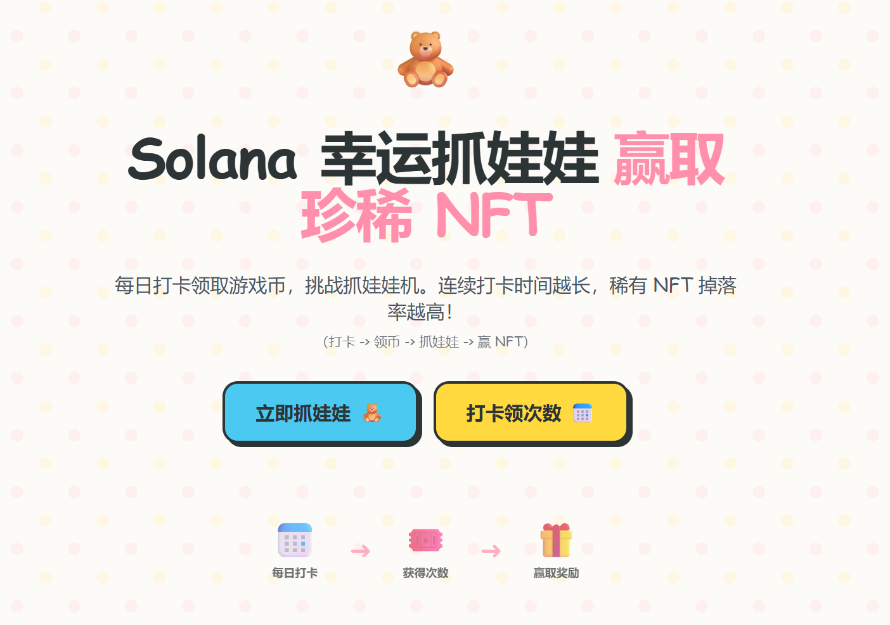
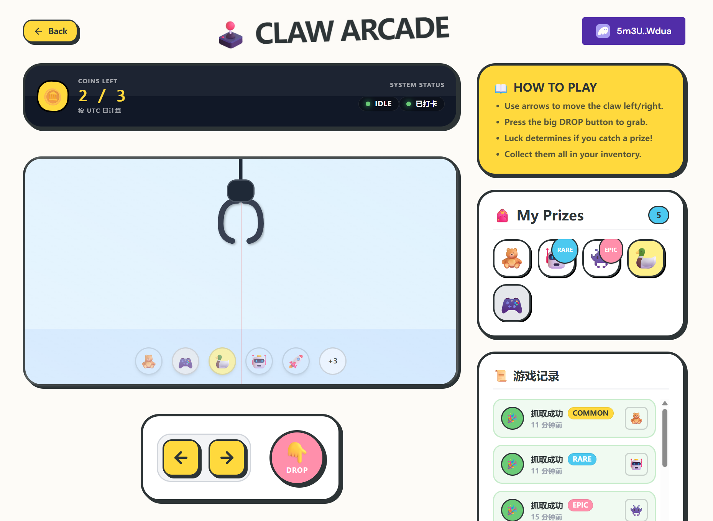
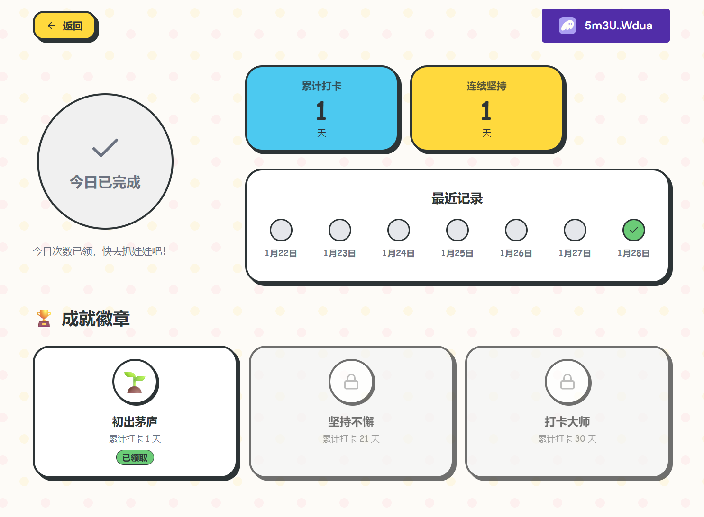

# Solana 幸运抓娃娃 (Solana Lucky Claw Machine)

> 🧸 每日打卡领币，挑战抓娃娃机，赢取珍稀 Solana NFT！

## 💻 项目 Repo

https://github.com/StudiousXiaoYu/Solana-bootcamp-2026-s1

## 📌 项目简介

**Solana 幸运抓娃娃** 是一个结合了 **链上打卡** 与 **休闲游戏** 的趣味 DApp。

在这个应用中，"打卡"不再是枯燥的任务，而是获取游戏资源的途径。用户通过每日在 Solana 链上签到，领取“游戏币”，然后使用游戏币操作抓娃娃机。抓到的娃娃将作为 NFT 徽章收藏在用户的展示柜中。

项目旨在探索 **GameFi + 社交留存** 的新模式：通过游戏化的方式提高用户每日活跃度。

## 🌟 核心功能

1.  **🕹️ 幸运抓娃娃机**
    *   基于 React 实现的互动抓娃娃小游戏。
    *   真实的物理反馈与抓取动画。
    *   包含多种稀有度的娃娃（普通、稀有、史诗、传说）。

2.  **📅 链上打卡系统**
    *   基于 Anchor 开发的智能合约。
    *   记录用户每日打卡状态与连续打卡天数（Streak）。
    *   打卡即送“游戏币”，连续打卡可获得额外幸运加成。

3.  **🏆 NFT 成就徽章**
    *   抓到的娃娃会自动存入用户的“战利品”列表。
    *   未来规划：将战利品 mint 为链上 NFT。

4.  **⚡️ 双模式体验**
    *   **Mock 模式**：默认开启。无需安装钱包，直接体验前端交互流程（数据存储在 localStorage）。
    *   **链上模式**：配置 ProgramId 后，连接 Phantom 钱包，体验真实的 Solana 交互。

## 🛠️ 技术栈

- **智能合约**: Rust + Anchor Framework (@coral-xyz/anchor ^0.32.1)
- **前端框架**: Next.js 14 (App Router) + TypeScript
- **样式方案**: Tailwind CSS + CSS Modules (动画效果)
- **SDK**: @solana/web3.js, @solana/wallet-adapter

## 🚀 快速开始 (本地运行)

### 第一步：启动前端 (推荐)

无需部署合约，直接体验 UI 和游戏逻辑。

```powershell
# 进入前端目录
cd .\finalProject\checkin-dapp\frontend

# 安装依赖
npm ci

# 启动开发服务器
npm run dev
```

打开浏览器访问：[http://localhost:3000](http://localhost:3000)

### 第二步：部署合约 (进阶)

如果你想体验真实的链上交互 (Winodws 用户推荐使用 WSL2)：

1.  **启动本地验证器**:
    ```bash
    solana-test-validator
    ```

2.  **构建与部署**:
    ```bash
    cd finalProject/checkin-dapp/program
    yarn install
    anchor build
    anchor deploy
    ```

3.  **获取 Program ID**:
    部署成功后，终端会显示 Program ID。

4.  **配置前端环境变量**:
    在 `frontend` 目录下新建或修改 `.env.local` 文件：
    ```env
    NEXT_PUBLIC_RPC_URL=http://127.0.0.1:8899
    NEXT_PUBLIC_PROGRAM_ID=<你的 Program ID>
    ```

5.  **重启前端**:
    重新运行 `npm run dev`，前端将自动检测并切换到链上模式。

## 🎬 截图展示

| 首页 (Home) | 抓娃娃 (Game) | 打卡 |
|---|---|---|
|  |  ||

## ✍️ 项目创作者

1. **昵称**：小雨
2. **联系方式**：微信：StudiousXiaoYu
3. **Solana 钱包地址**：45r8M7tvNnRLCvbD8ALJKpj6iEedzZcNBk47JhfPbNhf
