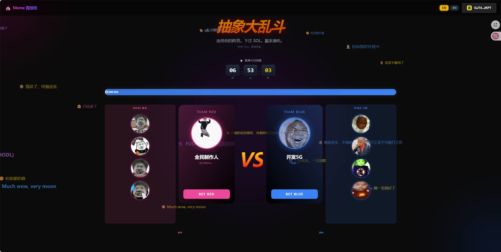
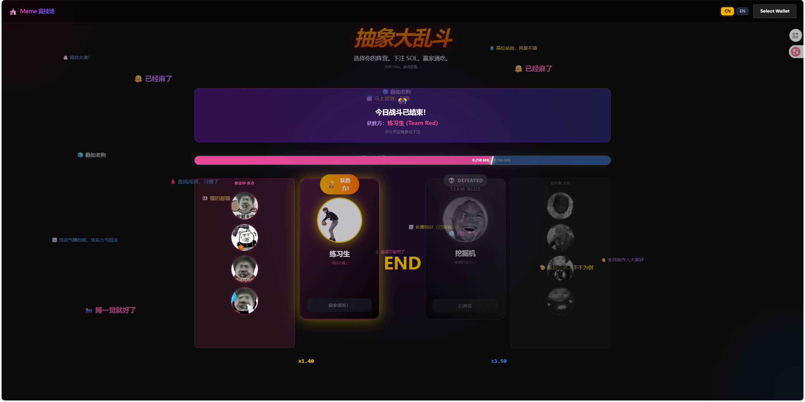

# Meme Arena (抽象竞技场)

## 💻 项目 Repo

[Oronm-boop/meme-arena: meme](https://github.com/Oronm-boop/meme-arena)

## 📌 项目简介

Meme Arena 是一个基于 Solana 区块链的去中心化“抽象文化”对战竞猜平台。它致力于解决传统竞猜平台的不透明问题，并为 Meme 文化提供了一个高互动性的娱乐对抗场景。

在 Meme Arena 中，用户可以选择支持自己喜欢的 Meme 阵营（例如“鸡你太美” vs “范小勤”）并使用 SOL 进行下注。项目采用独特的 "Money is Justice"（资金即正义）规则，由智能合约自动根据双方资金池的规模判定胜负——资金多的一方获胜并瓜分输家的资金。全流程链上执行，公开透明，杜绝黑箱操作。

## 🛠️ 技术栈

- **智能合约**：Rust + Anchor Framework (Solana Program)
- **前端**：React 19 + Vite + TypeScript + Tailwind CSS + Wallet Adapter
- **后端**：Go 1.24 + Gin + GORM + MySQL (提供每日对战主题配置)
- **部署与存储**：Vercel (前端), Linux (后端), Aliyun OSS

## 🎬 Demo 演示

### 演示链接
- 🎥 视频演示：https://youtu.be/U8UTubK3PrU
- 🌐 在线 Demo：https://meme-delta-inky.vercel.app/

### 功能截图

### 封面

### 下注

### 结算

## 💡 核心功能

1.  **动态自动赔率 (Pari-mutuel)**：系统不设固定赔率，赔率完全由对战双方的实时资金比例动态决定，风险与收益并在。
2.  **Money is Justice 胜负机制**：MVP 核心规则，截止时间后资金池总额较大的一方自动获胜，简单直接，刺激资金博弈。
3.  **完全去中心化结算**：从下注、奖池锁定到胜负判定和奖励分发，全部通过 Solana 智能合约指令 (`place_bet`, `auto_settle_game`, `claim_reward`) 自动执行。
4.  **每日轮换主题**：每日更新不同的热门 Meme 对决（如 Pepe vs Doge），保持平台的新鲜感和话题热度。

## ✍️ 项目创作者：

1.  创作者昵称：Ivo
2.  创作者联系方式：@bo_jian89456 （X）
3.  创作者 Solana USDC 钱包地址：GJT4RPKAhnNtoDy1rfRWFEQod8Hrc3ttbkeB5XUMJKPT
