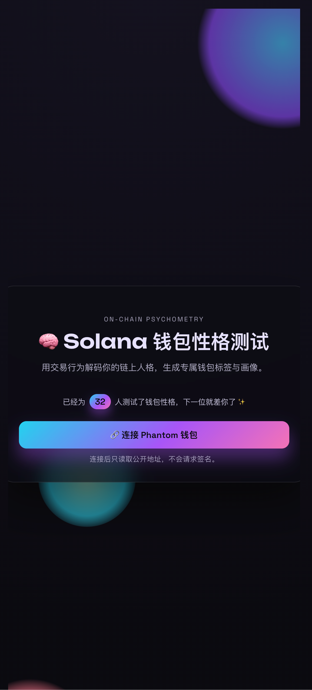
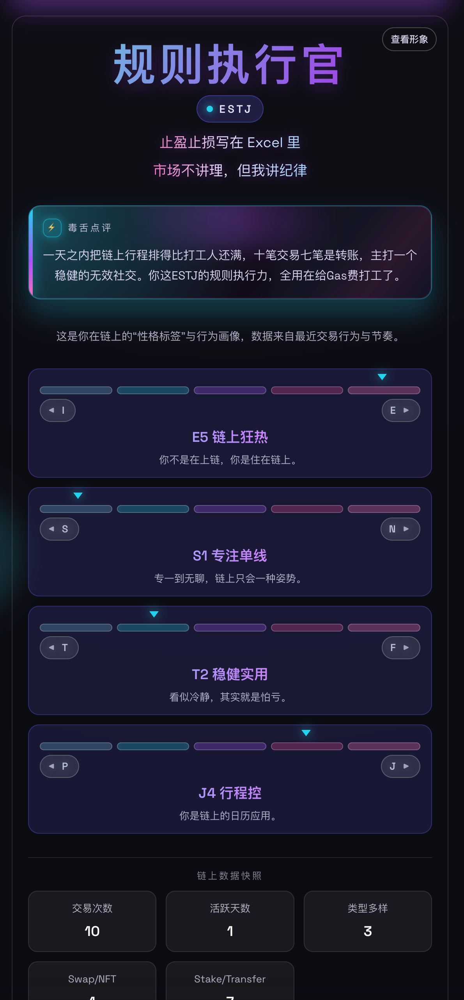
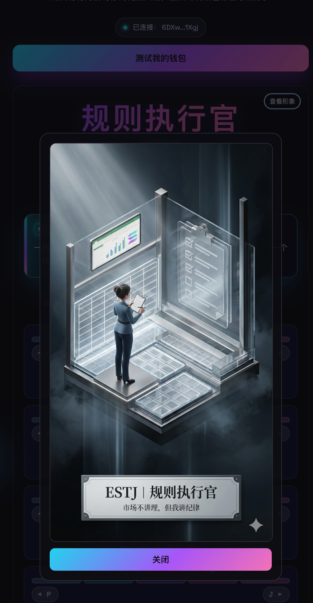

# 项目名称

链上人格测试/Solana钱包MBTI测试

## 💻 项目 Repo

https://github.com/z1gui/wallet-personality

## 📌 项目简介

这不是玄学，这是链上行为画像。
连接你的 Phantom 钱包，系统会用 Helius API 读取公开交易记录，产出一个“毒舌但合理”的 MBTI 性格标签。

## 🛠️ 技术栈

- 前端：Vite
- 后端：node + Express
- 工具：Helius API

## 🎬 Demo 演示

### 演示链接
- 🌐 在线 Demo：https://wallet-personality-xi.vercel.app/

### 功能截图

## 💡 核心功能

**示例：**
1. 生成MBTI类型
2. 根据交易记录生成毒舌文案
3. 生成MBTI形象

## ✍️ 项目创作者：

1. 创作者昵称 z1gui/Leon
2. 创作者联系方式 leon6line@gmail.com
3. 创作者 Solana USDC 钱包地址 6DXwWfKEeazQQVu7bLB3QkourSESPgcznaJuGsY21Xgj
